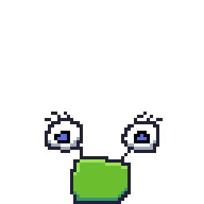
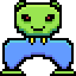

# My Art Portfolio
Art that I made either for fun or to be used in my games. Mostly pixel art, because that's all I can do, but if I ever end up learning vector art or 3d modelling or something like that, I'll surely add it here as well.

# Jumping Slime
  
This is actually the first pixel art animation I ever made. (Well, technically I have "animated" sprites which can be considered "pixel art" before, but all I ever did was rotate characters' legs back and forth, which can hardly be called animation.)

# Alien with no upper body
  
Can you believe it? This alien lacks an upper body! It's just a head on legs. I tried seriously drawing a whole body, but then this ended up being its shape, so I decided to just go with it!
